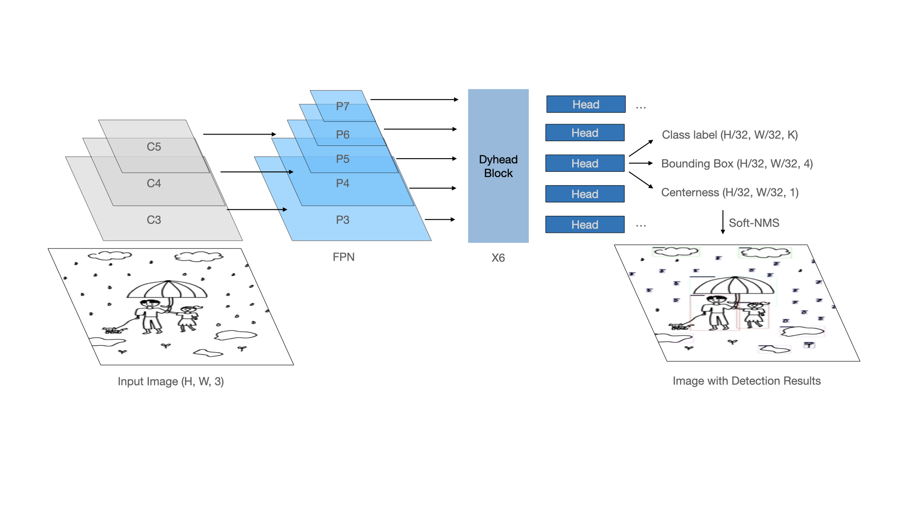

## Object detection for PITR test

  

This is an official implementation of ['Object detection based on the deep learning method in a person in the rain image'](https://www.earticle.net/Article/A422634). This project has been done with the Kosin Medical Hospital. 

### COCO 2017 Pretrained model
<table><tbody>
<!-- START TABLE -->
<!-- TABLE HEADER -->
<th valign="bottom"></th>
<th valign="bottom">swin-L_dyhead_fpn_2x_coco</th>
<th valign="bottom">config</th>
<!-- TABLE BODY -->
<tr><td align="left">pre-trained model</td>
<td align="center"><a href="https://download.openmmlab.com/mmdetection/v2.0/dyhead/atss_swin-l-p4-w12_fpn_dyhead_mstrain_2x_coco/atss_swin-l-p4-w12_fpn_dyhead_mstrain_2x_coco_20220509_100315-bc5b6516.pth">download(github)</a></td>
<td align="center"><a href="https://github.com/open-mmlab/mmdetection/blob/master/configs/dyhead/atss_swin-l-p4-w12_fpn_dyhead_mstrain_2x_coco.py">config(mmdet)</a></td>
</tr>
</tr>
</tbody></table>

  
  
&nbsp;

  

    <b>OpenMMLab website</b>
    
      <a href="https://openmmlab.com">
        <i>HOT</i>
      </a>
    
    &nbsp;&nbsp;&nbsp;&nbsp;
    <b>OpenMMLab platform</b>
    
      <a href="https://platform.openmmlab.com">
        <i>TRY IT OUT</i>
      </a>
    
  

  
&nbsp;

